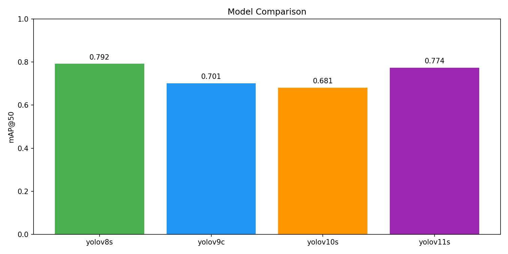

# YOLO Model Comparison for Pothole Detection

A systematic comparison of 4 YOLO architectures trained on the ikigai Pothole V2 dataset.

## Methodology

### Training Setup
| Setting | Value |
|---------|-------|
| Dataset | ikigai Pothole V2 (1,481 images) |
| Train/Valid/Test | 1,296 / 123 / 62 |
| Epochs | 50 (early stopping patience=15) |
| Batch Size | 16 |
| Image Size | 640×640 |
| Hardware | Google Colab T4 GPU |

### Models Evaluated
| Model | Variant | Parameters | Architecture Highlights |
|-------|---------|------------|------------------------|
| YOLOv8 | small (s) | 11.2M | CSPDarknet + C2f blocks |
| YOLOv9 | compact (c) | 25M | GELAN + PGI |
| YOLOv10 | small (s) | 8M | NMS-free, efficiency focus |
| YOLOv11 | small (s) | 9.4M | Latest Ultralytics iteration |

---

## Results

### Performance Metrics

| Model | mAP@50 | mAP@50-95 | Precision | Recall |
|-------|--------|-----------|-----------|--------|
| **YOLOv8s** 🏆 | **0.792** | **0.447** | 0.784 | **0.717** |
| YOLOv11s | 0.774 | 0.419 | 0.848 | 0.660 |
| YOLOv9c | 0.701 | 0.345 | **0.857** | 0.604 |
| YOLOv10s | 0.681 | 0.369 | 0.725 | 0.621 |

### Visual Comparison

---

## Analysis

### Why YOLOv8s Won Over Newer Models

#### 1. Dataset Size & Complexity Match
| Factor | Impact |
|--------|--------|
| **1,481 images** is relatively small | Simpler architectures generalize better |
| **Single class** (pothole only) | Advanced multi-scale features are overkill |

Newer models like YOLOv9c (25M params) have more capacity → **more prone to overfitting** on small datasets.

#### 2. Architecture Maturity
- **YOLOv8**: Highly optimized, battle-tested, excellent default hyperparameters
- **YOLOv9/v10/v11**: Newer, may not have optimal defaults for all scenarios

#### 3. Task Simplicity
Pothole detection is relatively "simple":
- Potholes are mostly dark, blob-like shapes
- YOLOv8s's feature extraction is sufficient
- Advanced features like GELAN (v9) or NMS-free (v10) don't add value here

#### 4. Recall vs Precision Trade-off

| Model | Precision | Recall | Behavior |
|-------|-----------|--------|----------|
| YOLOv8s | 0.784 | **0.717** | Balanced - catches more potholes |
| YOLOv9c | **0.857** | 0.604 | Conservative - misses ~11% more |
| YOLOv11s | 0.848 | 0.660 | Conservative - misses ~6% more |

**For road safety, recall matters more** — you'd rather have occasional false alarms than miss real potholes.

---

## Model Selection Justification

**Selected: YOLOv8s**

| Criteria | Why YOLOv8s Wins |
|----------|------------------|
| **mAP@50** | Highest at 79.2% |
| **Recall** | Best at 71.7% (safety-critical) |
| **Balance** | Good precision without sacrificing recall |
| **Simplicity** | Fewer parameters, less overfitting risk |
| **Maturity** | Well-tested, stable defaults |

### Key Insight
> "Newer ≠ Better" — Model selection should be data-driven, not hype-driven. For small, single-class datasets, simpler architectures often outperform complex ones.

---

## Recommendations

### For This Dataset
✅ **Use YOLOv8s** — best overall performance

### For Larger Datasets (>10K images)
Consider re-evaluating YOLOv9c/v11s as they may benefit from more data to leverage their advanced architectures.

### For Production Deployment
- Use confidence threshold ≥ 0.5 to reduce false positives
- Consider ensemble with multiple thresholds for different use cases
